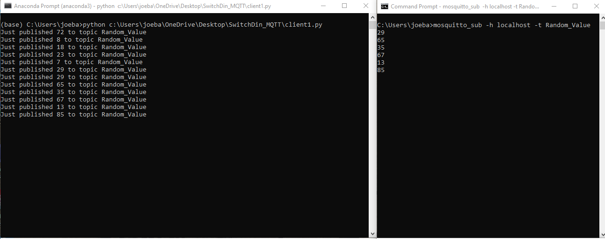
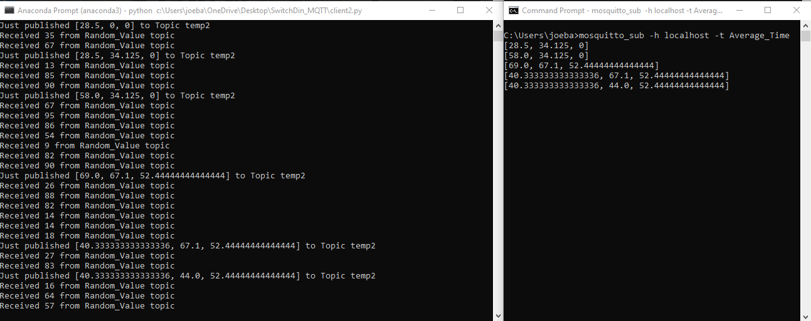
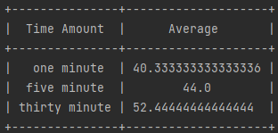

# SwitchDin_MQTT
Skills Assessment

# The client applications  

The client applications are used to subscribe and publish to MQTT using the paho library found at https://pypi.org/project/paho-mqtt/.

## client1.py

The client1.py file is used to publish a random number between 1 and 100 to the MQTT topic "Random_Value" at a random time interval between 1 and 30 seconds. Figure 1 shows the output of client1.py(left) and the output of a mosquitto subscription to topic "Random_Values" (right). 

Figure 1: Output of client1.py and mosquitto mqtt subscription to topic "Random_Values"

## client2.py

The client2.py file is subscribed to the topic "Random_Number", reads the random number from the broker, and calculates the averages of the random input at 1 minute, 5 minute and thirty-minute time intervals. If any of the time intervals update it then publishes the updated results to "Averages" topic.  Figure 2 shows the output of client2.py(left) and the output of a mosquitto subscription to topic "Averages" (right). 

Figure 2: Output of client2.py and mosquitto mqtt subscription to topic "Averages"

## client3.py

The client3.py file is subscribed to the topic "Averages" and prints these statistical valuse out in a pretty tabular table layout on the console. Figure 3, shows the output on the console from client3.

  

Figure 3: Output of client3.py table of averages

# The supporting files

### random_numbers.py

random_numbers.py has the functions used to generate the random values as well as the random time.

### averages.py

The averages.py file holds the classes that are used to compute the 1, 5, and 30 minute averages. 

### tables.py

The tables file uses the pretty table library to create the table used by client3 to publish the final results shown in figure 3. The pretty table library can be found at https://pypi.org/project/pretty-tables/.

# Running the application

For the applications to produce the 1) random number, 2) average values list, 3) print the table. The order the applications need to be ran are as follows:

1) client3.py
2) client2.py
3) client1.py

The reason that the application needs to be ran in this order is if a broker receives a published message to a topic and no one has subscribed to it then the broker discards the message.  Because, client3 is subscribed to "Averages" and that topic is published by client2, and client2 is subsribed to "Random_Value" and that topic is published by client2.  If the applications are ran in a different order then there is risk of missing data points. 

* note mqtt_publish2.py will publish 0 for each of the average values until the appropriate time frame is reached, then will update the values each time frame is reached after the initial timeframe.   

# Changes needed before implementation 

1) The current broker for each of the clients are localhost, need to update to a proper ip address.  
2) Currently if client2 loses connection then the averages will start from [0,0,0]. Need to come up with a proper way to queue published messages from client1, because if no clients have subscribed to the topic or they aren’t currently connected, then the message is removed from the broker. We can add the retain messages flag but this will only work for one missed message. 

# Libraries needed for project
1) Paho MQTT: https://pypi.org/project/paho-mqtt/
2) Pretty Tables: https://pypi.org/project/pretty-tables/.
